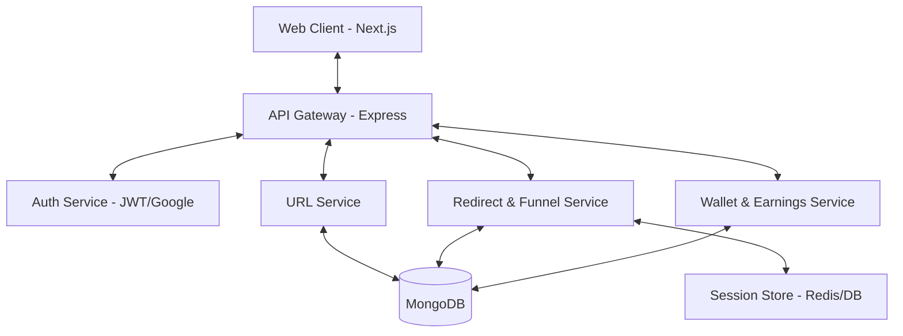
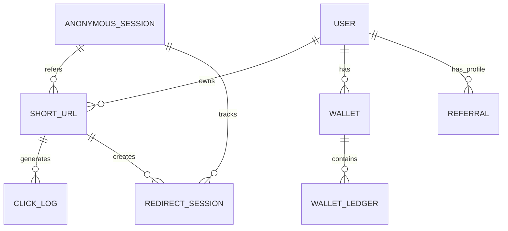
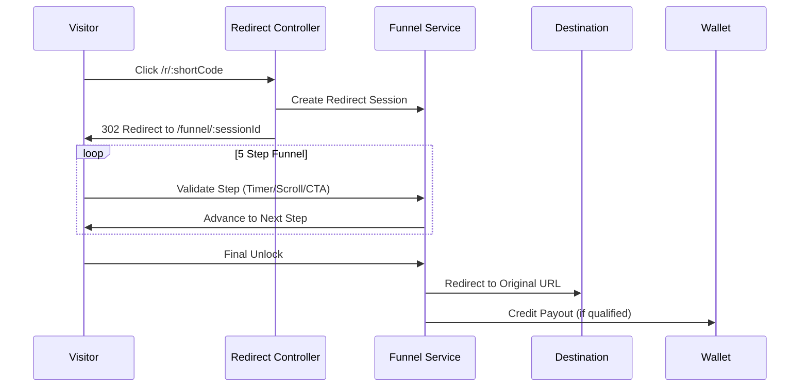
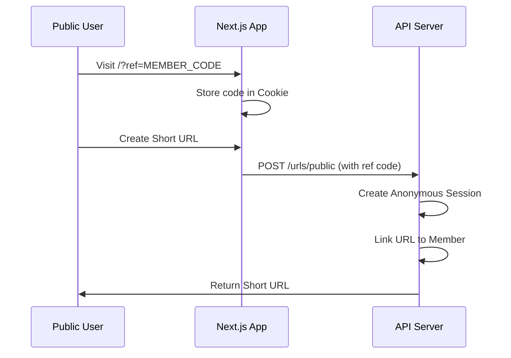

# Purplemerit: Next-Gen Monetized Link Shortener SaaS

Purplemerit is a high-performance, enterprise-ready Link Shortener SaaS built for the creator economy. It features a sophisticated multistep monetization funnel, transparent referral attribution, and a real-time earnings engine.

## 🚀 Key Features

*   **Multistep Monetization Funnel**: A 5-stage verification process for redirects, ensuring high-quality traffic for advertisers and maximum payouts for creators.
*   **Referral Attribution Engine**: Automatic tracking of referred traffic and link generation, even for anonymous users.
*   **Bulk URL Generator**: Batch process hundreds of links instantly with plan-based limits.
*   **Real-time Earnings Ledger**: Integrated wallet system with qualified click payouts (CPM) and referral commissions.
*   **Role-Based Access Control (RBAC)**: Secure partitioned interfaces for Admins, Members, and Advertisers.
*   **Advanced Analytics**: Deep insights into clicks, unique visits, country-wise distribution, and device behavior.

---

## 🏗️ System Architecture



### Database Relationship Flow



---

## 🛠️ Workflows

### 1. Public Redirect Workflow (Monetized)



### 2. Referral Attribution Workflow



---

## 📁 Folder Architecture

```text
link-shortener/
├── apps/
│   ├── api/                # Express.js Backend
│   │   ├── src/
│   │   │   ├── models/     # Mongoose Schemas (21 Models)
│   │   │   ├── modules/    # Business Logic (Auth, URL, Redirect, Wallet)
│   │   │   ├── repositories/ # DB Access Layer
│   │   │   └── scripts/    # Seeding & Jobs
│   └── web/                # Next.js Frontend (App Router)
│       ├── src/
│       │   ├── app/        # Pages (Admin, Dashboard, Funnel)
│       │   ├── components/ # UI Components (Tailwind + Lucide)
│       │   └── store/      # State Management (Zustand)
└── packages/               # Shared Types & Configs
```

---

## 🚦 Local Setup

1.  **Clone the Repository**
2.  **Install Dependencies**: `npm install`
3.  **Environment Setup**: 
    *   Copy `apps/api/.env.example` to `apps/api/.env`
    *   Copy `apps/web/.env.example` to `apps/web/.env`
4.  **Database Seeding**: 
    ```bash
    cd apps/api
    npx ts-node src/scripts/seed-plans.ts
    npx ts-node src/scripts/seed-demo-data.ts
    ```
5.  **Run Development Servers**:
    ```bash
    npm run dev:api
    npm run dev:web
    ```

---

## 📈 Roadmap

- [x] Multistep Monetization Funnel
- [x] Referral Attribution Engine
- [x] Bulk URL Generator
- [x] Member Analytics Dashboard
- [ ] Multi-currency Support
- [ ] API Webhooks for Developers
- [ ] Mobile App (Flutter/React Native)

---

&copy; 2026 Purplemerit Engineering. All rights reserved.
