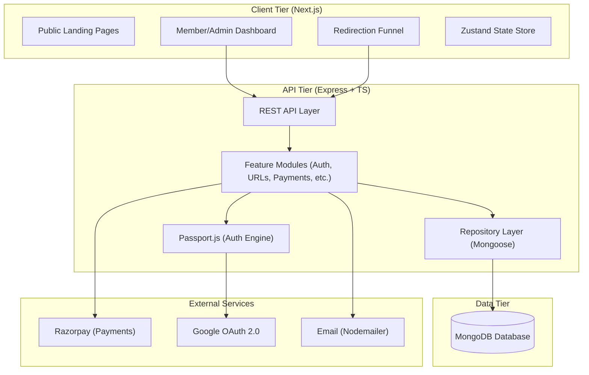
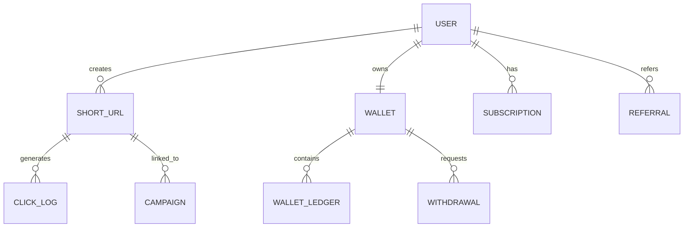
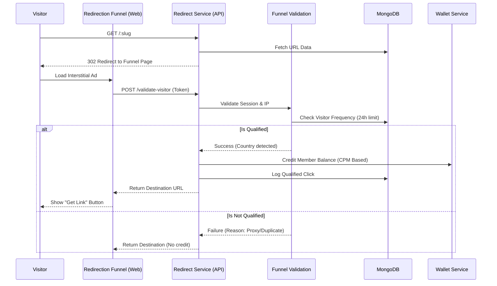

# Purplemerit Link Shortener SaaS - Engineering & Architecture Report

## 1. Executive Summary
Purplemerit Link Shortener is a sophisticated SaaS platform designed for URL management and monetization. It leverages a modern full-stack TypeScript architecture to provide a high-performance, secure, and scalable solution for publishers to monetize their digital traffic through qualified visitor redirection.

---

## 2. System Architecture

The platform follows a **Clean Modular Monorepo** architecture, separating frontend concerns from backend business logic while sharing type definitions and configuration.

### 2.1 High-Level Architecture Diagram


### 2.2 Design Philosophy
- **Separation of Concerns**: The API is strictly separated into Modules (Logic), Routes (Endpoints), and Models (Data).
- **Stateless API**: Authentication is handled via JWT with Refresh Token rotation, ensuring horizontal scalability.
- **Qualified Redirects**: A complex validation engine ensures that only human, unique visitors result in earnings, preventing bot abuse.

---

## 3. Database Design & Schema

The system uses MongoDB for its flexible schema, which is essential for handling dynamic click logs and diverse user data.

### 3.1 Core Entity Relationship


### 3.2 Key Data Models
- **UserModel**: Stores identity, roles (ADMIN/MEMBER/ADVERTISER), and authentication state.
- **ShortUrlModel**: Maps unique slugs to destination URLs, tracking ad mode (DIRECT/MONETIZED) and status.
- **ClickLogModel**: Captures granular visitor data (IP, User-Agent, Referrer, Country) for qualification.
- **WalletModel**: Maintains real-time balance and transaction history.

---

## 4. Technical Workflows

### 4.1 Monetized Redirection & Earning Flow
This is the core business logic of the platform.



### 4.2 Subscription Lifecycle
1.  **Selection**: Member chooses a plan (Premium/Enterprise).
2.  **Order**: API generates a Razorpay Order ID.
3.  **Payment**: Frontend executes `Razorpay.open()`.
4.  **Webhook/Verification**: API verifies the payment signature and activates the `Subscription` document, unlocking higher URL limits and better CPM rates.

---

## 5. Tech Stack Deep Dive

### Backend (Express/Node.js)
- **TypeScript**: Provides type safety across the entire request-response lifecycle.
- **Passport.js**: Robust authentication middleware supporting JWT and Google OAuth.
- **Mongoose**: ODM for MongoDB with strict schema validation.
- **Zod**: Runtime validation for API inputs, ensuring data integrity before processing.
- **Morgan/Winston**: Comprehensive logging for auditing and debugging.

### Frontend (Next.js 15)
- **App Router**: Optimized routing and server-side rendering where applicable.
- **Zustand**: Lightweight global state management for auth and UI.
- **Tailwind CSS**: Utility-first styling for a premium, responsive interface.
- **Lucide Icons**: Consistent, modern iconography.

---

## 6. Environment & Configuration

### Detailed Variable Mapping

#### API Configuration (`apps/api/.env`)
| Key | Context | Importance |
| :--- | :--- | :--- |
| `MONGODB_URI` | Database | Critical for persistence. |
| `SESSION_SECRET` | Security | Used for signing session cookies. |
| `JWT_ACCESS_SECRET` | Security | Secret key for short-lived access tokens. |
| `GOOGLE_CLIENT_ID` | Auth | Required for "Login with Google" feature. |
| `SMTP_USER/PASS` | Communication | Required for password resets and notifications. |
| `RAZORPAY_KEY_ID` | Financial | Required for subscription processing. |

#### Web Configuration (`apps/web/.env.local`)
| Key | Context | Importance |
| :--- | :--- | :--- |
| `NEXT_PUBLIC_API_BASE_URL` | Integration | Points to the backend API. |
| `NEXT_PUBLIC_APP_URL` | SEO/Auth | Used for generating absolute URLs. |

---

## 7. Deployment Strategy

The project is pre-configured for **Render.com** via the `render.yaml` blueprint.

- **Frontend**: Deployed as a static/SSR site with automated builds from `.`.
- **Backend**: Deployed as a Web Service from `apps/api`.
- **Database**: Recommended to use **MongoDB Atlas** for production reliability.
- **Scaling**: The stateless design allows for horizontal scaling of the API service.

---

## 8. Quick Start Guide

1.  **Clone & Install**:
    ```bash
    git clone <repo-url>
    npm install
    ```
2.  **Environment Setup**:
    Populate `.env` in `apps/api` and `.env.local` in `apps/web`.
3.  **Database Seeding**:
    ```bash
    cd apps/api
    npm run seed:plans   # Create default plans
    npm run seed:admin   # Create initial admin user
    ```
4.  **Development Mode**:
    ```bash
    # From root
    npm run dev --workspace=@link-shortener/api
    npm run dev --workspace=@link-shortener/web
    ```
