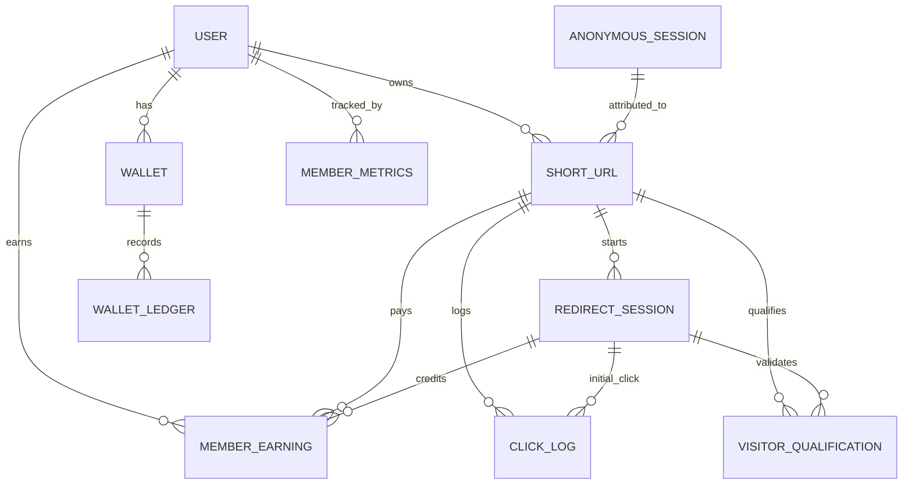

# System Design

## Architecture

Purplemerit is a monorepo with two runtime surfaces:

- `apps/api`: Express + MongoDB backend for auth, link creation, redirect sessions, payouts, and analytics.
- `apps/web`: Next.js frontend for landing pages, public monetization pages, and member/admin dashboards.

The redirect path is now session-driven rather than destination-driven. Public visitors are routed through `/visit/:shortCode`, then through the staged monetization pages, and only the backend can release the final destination after completion.

### Core Components

- URL service: creates and manages short links, status, and URL metadata.
- Redirect service: inspects short codes, creates signed redirect sessions, validates staged progression, and releases the final destination only after the flow completes.
- Qualification ledger: records unique qualified completions with 48-hour duplicate suppression.
- Member earning ledger: stores payout-ready earning entries for each qualified completion.
- Wallet + metrics: credits member balances and updates dashboard counters.

## Redirect Funnel Workflow

1. Visitor opens `/{shortCode}` or `/r/{shortCode}`.
2. The legacy redirect path forwards the visitor to `/visit/{shortCode}`.
3. `/visit/{shortCode}` creates a signed redirect session and records the raw open.
4. `/monetize/start` runs the stage-0 validation timer and captcha gate.
5. `/monetize/blog/1`, `/monetize/blog/2`, and `/monetize/blog/3` enforce staged timers, scroll depth, and sponsor interaction.
6. `/monetize/unlock` performs the final server-validated unlock timer.
7. The backend checks duplicate qualification, credits the member, updates metrics, and returns the original destination only at the end.

## Database Model Map

### Important Collections

- `ShortUrl`: link metadata plus raw opens, funnel progress counts, and qualified completion counts.
- `RedirectSession`: staged funnel state, visitor metadata, sponsor click status, and completion timestamps.
- `VisitorQualification`: one unique qualified completion per visitor window.
- `MemberEarning`: payout ledger for member earnings.
- `ClickLog`: raw and qualified click analytics.
- `MemberMetrics`: dashboard totals for links, users, clicks, and earnings.

## Route Map

### Public Web Routes

- `/r/[shortCode]`: compatibility redirect into `/visit/[shortCode]`.
- `/visit/[shortCode]`: session bootstrap for the monetized flow.
- `/monetize/start`: stage 0 start page.
- `/monetize/blog/[step]`: staged article pages for steps 1 to 3.
- `/monetize/unlock`: final unlock page.

### API Routes

- `POST /public/visit/:shortCode`: create a signed redirect session.
- `POST /public/funnel/validate/:sessionId`: server-validate stage progression.
- `GET /public/session/:sessionId/status`: public-safe session status.
- `POST /public/session/:sessionId/event`: record sponsor and funnel events.
- `POST /public/complete/:sessionId`: release the original destination after qualification.
- `GET /users/:id/anonymous-links`: member anonymous link widget data.
- `GET /users/:id/earnings`: member earnings widget data.

## Design Notes

- The backend never exposes the original destination in the public session/status payloads.
- The final URL is only returned after the completion endpoint confirms all required stages.
- Duplicate visitor completions are suppressed for 48 hours using the qualification ledger.
- Member earnings are stored in a ledger first, then reflected in wallet and dashboard totals.
